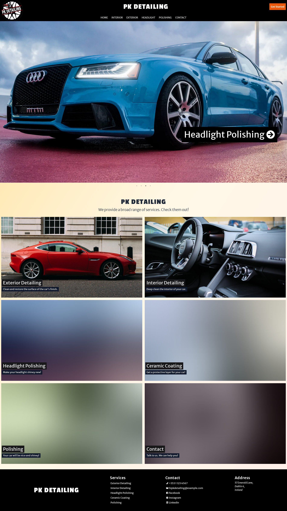
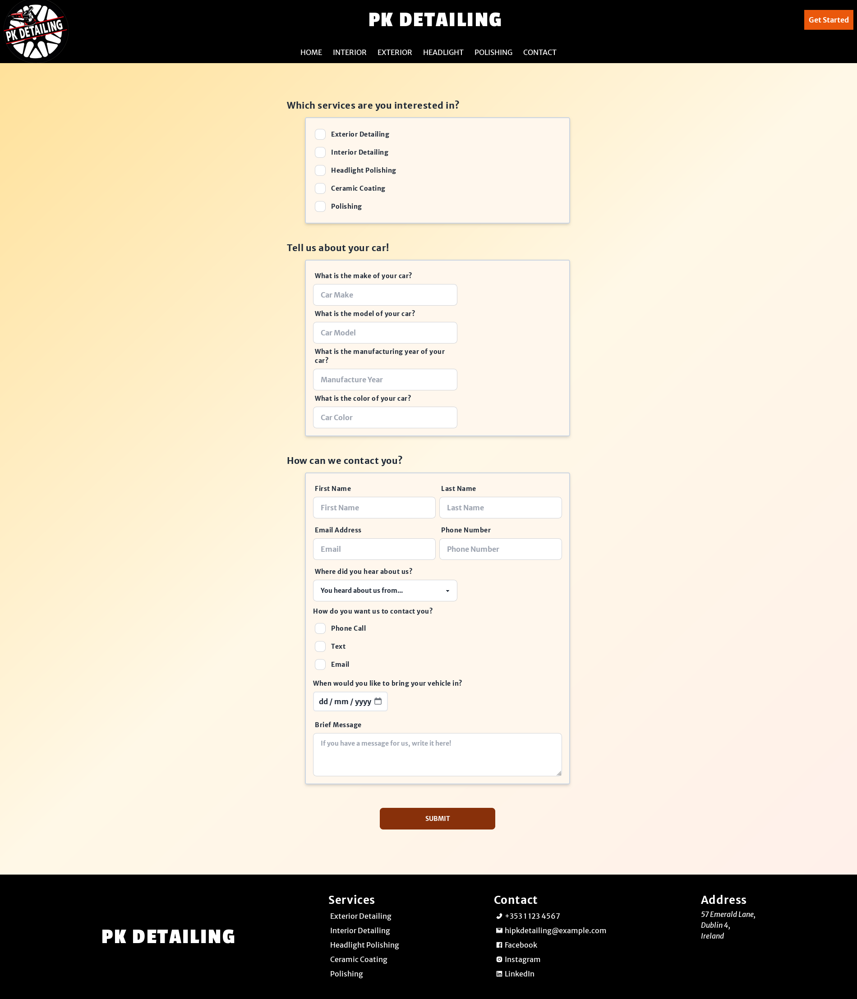

# A Next.js Website for a Car Detailing Shop

This project showcases a car detailing website built using modern web development technologies for a Car Detailing Shop. It provides a user-friendly interface to explore the company's services and conveniently book appointments online.

## Features

- Clear Service Presentation: Effectively communicates the services offered by Car Detailing Shop
- Online Booking: Enhances customer experience by allowing visitors to schedule appointments directly on the website
- Robust Data Validation: Utilizes Zod to ensure accurate and reliable user input for bookings

## Gallery

Home Page:



Online Booking:


## Tech Stack

- TypeScript: Enhances code maintainability and reduces errors by adding static type checking to JavaScript, improving code readability and preventing runtime type issues

- Next.js: Simplifies building server-rendered and statically generated web applications, offering features like routing, data fetching, and code-splitting for optimal performance and SEO

- React.js: Provides a component-based UI library for building dynamic and interactive user interfaces, allowing for efficient code reuse and a focus on component state management

- Tailwind CSS: Streamlines the styling process with a utility-first approach, offering pre-built CSS classes for common design elements, enabling rapid development and consistent UI

- Zod: Ensures robust form validation by defining data schemas that guarantee the structure and format of user input, preventing unexpected data issues and improving data integrity

## Setup

Clone the repository:

```bash
git clone https://github.com/2brownc/car-detailing.git
```

Install the dependencies:

```bash
yarn install
```

Build the app:

```bash
yarn build
```

Start the app:

```bash
yarn start
```

The website runs locally on http://localhost:3000 during development.
